# QRbitr – Quick, Private, Offline Data Transfer in the Browser
  
[QRbitr App](https://austinwin.github.io/qrbitr/): https://austinwin.github.io/qrbitr/  

  

**QRbitr** is a browser-only application for sending and receiving small files or text via a rapid sequence of QR codes.  
It’s **private by design** - no one, including IT admins or network monitors, can see your transfer because **nothing ever leaves your devices**.  
No setup, no account, no Bluetooth pairing, no cables - just open it in a browser and transfer.  

**Perfect for**:
- Moving data between a work laptop and a personal phone without triggering network logging.
- Sharing files when you have **no internet**, **no USB cable**, or **no permission to install software**; just pwa.
- Quick one-off transfers without signing into cloud services.
- **Large text files** — automatically compressed before sending and decompressed on the receiver's side for faster, more efficient transfer.

Because QRbitr runs entirely in your browser and operates offline, it leaves no server trace, requires no pairing, and is as simple as pointing a camera at a screen either through the online web app or pwa.

  
  

  
  

---

## Features

- **Offline** file & text transfer (client-side only, no servers).
- **Privacy-first** – nothing is sent over a network.
- **Fountain coding (LT codes)** with **robust soliton distribution** for resilience to frame drops.
- **Peeling decoder** with **Gaussian elimination** fallback for complete recovery.
- **Automatic compression** (Deflate via pako) when beneficial — great for large text files.
- **Real-time QR generation** at configurable FPS.
- **Adaptive redundancy** (extra fountain frames) to improve success in noisy conditions.
- **CRC-32** integrity checks for final verification.
- **On-screen debug logs** – easily view detailed transfer logs directly in the browser (works even on mobile).
- Works on modern desktop & mobile browsers, installable as a PWA.

---

## About the protocol

QRbitr implements a **one-way, high-redundancy broadcast protocol** over visual QR frames.  
It uses **LT (Luby Transform) fountain codes** to generate a stream of QR frames where each frame carries either original data chunks or XOR combinations.  
The receiver collects any sufficient subset of frames to reconstruct the payload — no need for every frame to arrive.  
This is ideal for environments where frame loss is common, like camera scans of rapidly changing QR codes.  

---

## How it works (high level)

```mermaid
flowchart TD
  subgraph Sender [Sender]
    A[File/Text Input] --> B[Chunking]
    B --> C[Optional Compression Deflate]
    C --> D[Metadata Frame]
    C --> E[Base Chunks]
    E --> F[LT Encoder - robust soliton]
    D --> G[QR Frame Builder]
    F --> G
    G --> H[QR Renderer @ FPS]
  end

  subgraph Receiver [Receiver]
    I[Camera] --> J[jsQR Decoder]
    J --> K[Frame Parser]
    K --> L[Chunk Store + Index]
    L --> M[Peeling Decoder]
    M -->|stalled| N[Gaussian Elimination]
    M -->|recovered| O[Reassembly]
    N --> O
    O --> P[Decompression if used]
    P --> Q[CRC-32 Verify & Download]
  end
```

**Pipeline summary**  
1. Sender splits data into fixed-size chunks and creates a metadata frame.  
2. LT encoder emits a mix of original and fountain (XOR) chunks following a robust soliton distribution.  
3. Each chunk becomes a QR frame; frames cycle at the configured FPS.  
4. Receiver scans frames; peeling + (if needed) Gaussian elimination reconstruct missing chunks.  
5. Payload is reassembled, decompressed (if used), CRC-checked, and saved.

---

## Algorithms & references

- **Fountain codes** – general concept: [Wikipedia: Fountain code](https://en.wikipedia.org/wiki/Fountain_code)  
- **LT (Luby Transform) codes** – encoding/decoding method used here:  
  [Wikipedia: LT codes](https://en.wikipedia.org/wiki/LT_codes)  
- **Peeling decoder** – iterative XOR elimination: see LT codes link above.  
- **Gaussian elimination** – linear algebra fallback:  
  [Wikipedia: Gaussian elimination](https://en.wikipedia.org/wiki/Gaussian_elimination)  
- **CRC-32** – integrity check:  
  [Wikipedia: Cyclic redundancy check (CRC-32 section)](https://en.wikipedia.org/wiki/Cyclic_redundancy_check#CRC-32)  
- **Deflate (pako)** – optional compression:  
  [Wikipedia: Deflate](https://en.wikipedia.org/wiki/Deflate)  

---

## Project structure

- `index.html` – App UI and wiring.
- `qr-stream.js` – Send/receive logic, frame creation, progress, events.
- `lt-codes.js` – Fountain code encoder/decoder, soliton distribution.
- `prng.js` – Pseudo-random number generator for chunk selection.
- `utils.js` – CRC-32, Base64 helpers, formatting, decompression.
- `jsQR.js` – QR scanning/decoding from camera frames.
- `qrcode.min.js` – QR generation.
- `pako.min.js` – Deflate/inflate compression.

---

## Quick start

1. Open `index.html` in a modern browser (desktop recommended for sending).  
2. **Send mode**: pick a file or paste text → set FPS/chunk size/redundancy → **Start**.  
3. **Receive mode**: allow camera access → point at sender’s screen → wait for progress → file auto-downloads.  

No build required. Can be hosted as static files for easy sharing.

---

## Configuration (main knobs)

| Param           | Default      | What it controls |
|-----------------|--------------|------------------|
| `chunkSize`     | `800` bytes  | Data bytes per QR frame before encoding. |
| `redundancy`    | `0.5`        | Ratio of extra fountain frames for resilience. |
| `fps`           | `20`         | QR frames per second displayed. |
| `maxFileSize`   | `10 MB`      | Safety cap for payload size. |
| `solitonC`      | `0.03`       | Robust soliton distribution parameter. |
| `solitonDelta`  | `0.05`       | Robust soliton distribution parameter. |

---

## Performance tips

- Keep `chunkSize` moderate (600–900 bytes) to balance frame count vs QR size.  
- Stay ≤ 10 FPS unless your receiver can decode faster.  
- Increase `redundancy` for poor lighting or shaky scanning.  
- Use a bright screen and steady positioning for best results.

---

## Browser support

- Modern Chrome, Edge, Firefox.  
- iOS Safari works but may have lower camera FPS.

---

## License

MIT (see `LICENSE`).

---
## Sponsor

